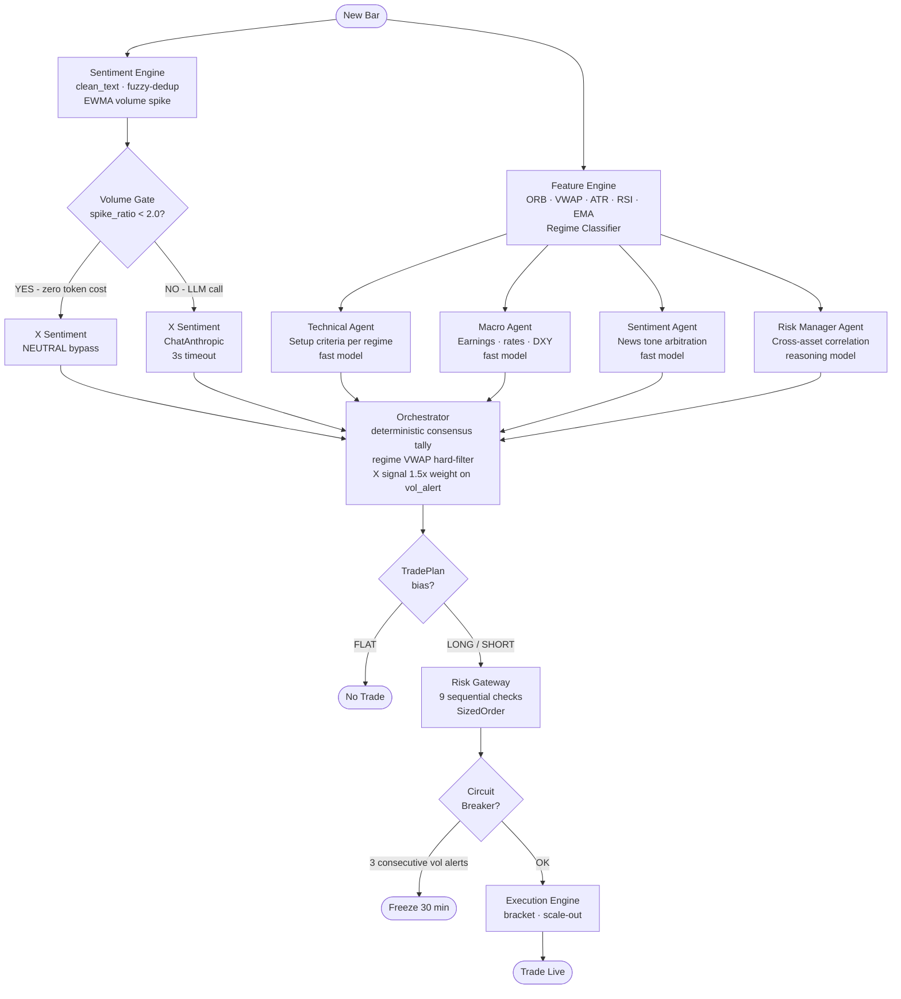
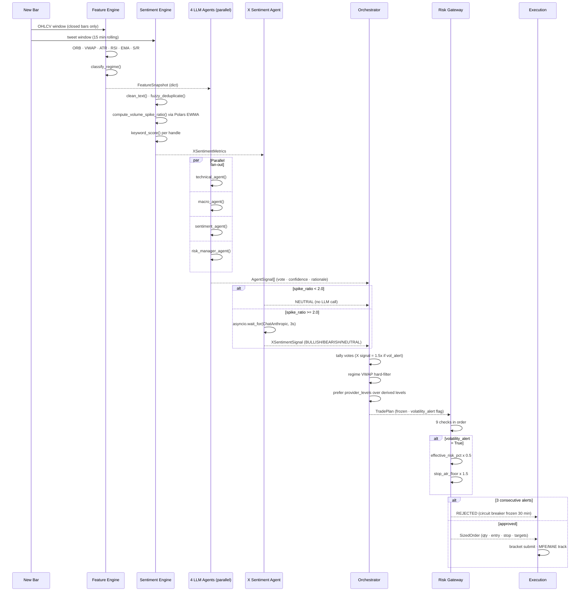

# Multi-Agent Trading System

Event-driven multi-agent trading system across US equities, forex, gold, and crypto.  
**LLM agents plan. Deterministic Python executes and risks.** LLMs are barred from the execution hot path.

---

## System Architecture

```
┌─────────────────────────────────────────────────────────────────────────────┐
│                        MULTI-AGENT TRADING SYSTEM                           │
├─────────────────────────────────────────────────────────────────────────────┤
│                                                                              │
│   MARKET DATA                  X / SOCIAL                  CONFIG            │
│  ┌──────────┐               ┌────────────┐            ┌──────────────┐       │
│  │  Broker  │               │ @DeItaone  │            │  Session     │       │
│  │ Adapters │               │ @fin.juice │            │  Profiles    │       │
│  │ (Alpaca  │               │ @unusual_  │            │  Keywords    │       │
│  │  OANDA   │               │  whales    │            │  Risk Limits │       │
│  │  CCXT)   │               └─────┬──────┘            └──────────────┘       │
│  └────┬─────┘                     │                                          │
│       │                    ┌──────▼──────┐                                   │
│       │                    │ INGESTION   │  twscrape pool · dedup · Postgres  │
│       │                    │  LAYER      │  raw_tweets (append-only)          │
│       │                    └──────┬──────┘                                   │
│       │                           │                                          │
│  ┌────▼──────────────────────────▼──────────────────────────────────────┐   │
│  │                    FEATURE ENGINE  (deterministic)                    │   │
│  │   ORB · VWAP · ATR · RSI · EMA · S/R · Regime Classifier             │   │
│  │   Sentiment Engine: clean_text · fuzzy-dedup · EWMA spike · scoring   │   │
│  └────────────────────────────┬──────────────────────────────────────────┘   │
│                               │  FeatureSnapshot + XSentimentMetrics         │
│  ┌────────────────────────────▼──────────────────────────────────────────┐   │
│  │                    LANGGRAPH  SLOW LOOP  (LLM lane)                   │   │
│  │                                                                        │   │
│  │   ┌───────────┐  ┌───────────┐  ┌───────────┐  ┌───────────┐         │   │
│  │   │ Technical │  │   Macro   │  │ Sentiment │  │   Risk    │         │   │
│  │   │   Agent   │  │   Agent   │  │   Agent   │  │  Manager  │         │   │
│  │   │  (fast)   │  │  (fast)   │  │  (fast)   │  │ (reason.) │         │   │
│  │   └─────┬─────┘  └─────┬─────┘  └─────┬─────┘  └─────┬─────┘         │   │
│  │         └──────────────┴──────────────┴──────────────┘                │   │
│  │                                                                        │   │
│  │   ┌──────────────────────────────────────────────────────────────┐    │   │
│  │   │              X SENTIMENT AGENT NODE                           │    │   │
│  │   │  volume_spike < 2.0  --> NEUTRAL bypass  (zero token cost)   │    │   │
│  │   │  volume_spike >= 2.0 --> ChatAnthropic  (3s hard timeout)    │    │   │
│  │   └──────────────────────────┬───────────────────────────────────┘    │   │
│  │                              │  AgentSignal[] + XSentimentSignal       │   │
│  │   ┌──────────────────────────▼───────────────────────────────────┐    │   │
│  │   │               ORCHESTRATOR  (deterministic)                   │    │   │
│  │   │  consensus tally · regime filter · X signal 1.5x weight       │    │   │
│  │   │  provider levels --> TradePlan (frozen Pydantic)              │    │   │
│  │   └──────────────────────────┬───────────────────────────────────┘    │   │
│  └──────────────────────────────┼───────────────────────────────────────── ┘  │
│                                 │  TradePlan                                   │
│  ┌──────────────────────────────▼───────────────────────────────────────────┐  │
│  │                   RISK GATEWAY  (deterministic — no LLM)                  │  │
│  │  geometry · stop floor · session · drawdown · RR · short · PDT · sizing   │  │
│  │  volatility_alert --> 50% size reduction + widened stops                  │  │
│  │  circuit breaker: 3 alerts --> freeze all entries 30 min                  │  │
│  └──────────────────────────────┬───────────────────────────────────────────┘  │
│                                 │  SizedOrder                                   │
│  ┌──────────────────────────────▼───────────────────────────────────────────┐  │
│  │                       EXECUTION FAST LOOP                                 │  │
│  │           bracket submit · scale-out · breakeven management               │  │
│  └───────────────────────────────────────────────────────────────────────────┘  │
└─────────────────────────────────────────────────────────────────────────────┘
```

---

## Agent Graph (LangGraph)



---

## Decision Flow — Every Bar



---

## X Sentiment Pipeline

```mermaid
flowchart LR
    subgraph SOURCES["X Sources"]
        D["@DeItaone\nWalter Bloomberg\nALL-CAPS geopolitical\nscope: ALL assets"]
        F["@financialjuice\nSquawk board\nBreaking macro\nscope: ALL assets"]
        U["@unusual_whales\nOptions flow\nPut/Call premium\nscope: EQUITY only"]
    end

    subgraph INGESTION["Ingestion Layer"]
        TS[twscrape\naccount pool + rotation\nexponential backoff x5]
        PG[(Postgres\nraw_tweets\nappend-only\nidx: ts · author_handle)]
        TS -- "dedup tweet_id\nON CONFLICT DO NOTHING" --> PG
    end

    subgraph ENGINE["Feature Engine - deterministic"]
        CT[clean_text\nlowercase · strip URLs\nstrip mentions]
        FD["fuzzy_deduplicate\nrapidfuzz >= 0.92\nO(n^2) on small windows"]
        VS[volume_spike_ratio\nPolars EWMA\n8x30-min bins · span=4]
        KS[keyword_score\nDeItaone/financialjuice: risk+macro\nunusual_whales: options flow]
        IM[XSentimentMetrics\nvolume_spike_ratio · model_score\nimpact_score · source_tweet_ids\ntop-5 high-impact samples]
        CT --> FD --> KS --> IM
        VS --> IM
    end

    subgraph AGENT["X Sentiment Agent Node"]
        VG{spike_ratio\n< 2.0?}
        NB[NEUTRAL bypass\nno token cost\nno latency]
        LLM[ChatAnthropic\ntemperature=0\nwith_structured_output\nasyncio.wait_for 3s]
        FB[NEUTRAL fallback\non timeout or error]
        PROM[Prometheus\nsignals_total\nllm_latency\ntimeout_total]
        VG -- YES --> NB
        VG -- NO --> LLM
        LLM -- timeout/error --> FB
        LLM --> PROM
    end

    D & F --> TS
    U --> TS
    PG -- "get_tweets_in_window 15 min" --> CT
    PG -- "get_tweets_in_window 4h history" --> VS
    IM --> VG
```



---

## Risk Gateway — 9 Sequential Checks

```
                        TradePlan (frozen)
                              |
                    +---------+---------+
               +----+   FLAT bias?      +----> approved=True, no order
               |    +-------------------+
               |
               |    +-------------------+
               |    | volatility_alert? |
               |    |  YES -> record    |
               |    |  NO  -> reset     |
               |    +---------+---------+
               |              |
               |    +---------+----------------------------+
               |    |  CIRCUIT BREAKER                     |
               |    |  3 consecutive alerts -> REJECT      |
               |    |  freeze_until = now + 30 min         |
               |    +---------+----------------------------+
               |              |
               |    Check 1 --+-- plan_geometry
               |              |   stop/target on correct side of entry
               |    Check 2 --+-- stop_distance
               |              |   risk_ps >= min_stop_atr_mult x ATR
               |              |   [x 1.5 if volatility_alert]
               |    Check 3 --+-- session_open
               |    Check 4 --+-- drawdown_lock  (daily DD < 6%)
               |    Check 5 --+-- reward_to_risk  (RR re-computed deterministically)
               |    Check 6 --+-- short_compliance  (shortable? SSR active?)
               |    Check 7 --+-- pdt  (equity sub-$25k -> max 3 DT/5d)
               |              |
               |    SIZING ----+-- effective_risk_pct = max_risk_pct
               |              |   [x 0.50 if volatility_alert]
               |              |   qty = min(qty_by_risk, qty_by_exposure, qty_by_bp)
               |              |
               |    Check 8 --+-- per_trade_risk  (single unit <= 2% budget)
               |    Check 9 --+-- buying_power
               |              |
               +------------- +------ ALL PASS? ------+
                         NO <-+                        +-> YES -> SizedOrder
                    rejected                               (qty · entry · stop · targets)
```

---

## CRT Gold Sweep-Reversal — Signal Detection

```
  H4 CANDLES (UTC-aligned: 00/04/08/12/16/20)
  ─────────────────────────────────────────────────────────────────────

  Last completed H4:
  +──────────────────────────────────────────────+
  |  range_high ─────────────────────────────── |  <-- target (SHORT)
  |              | H4 range candle |             |
  |  range_low  ─────────────────────────────── |  <-- target (LONG)
  +──────────────────────────────────────────────+

  Current H4 (M15 bars within this period):
  ─────────────────────────────────────────────────────────────────────

  BULLISH SETUP (low sweep -> long entry):

     range_low ────────+
                       |      Step 1: M15 wick sweeps below range_low
                ───────+──────────────────────────────── (wick below range)
                       |      Step 2: Displacement candle
                       |      body >= 1.0 x ATR  closes bullish
                       |      ^^^^^^^^
                       |      Step 3: MSS — subsequent close > react_high at sweep bar
                       |                    ──────────── react_high
                       |      Step 4: Find OB (last bearish bar before displacement)
                       |              +───+  <- OB candle (bearish, before displacement)
                       |              +───+
                       |      Step 5: OB_ONLY gate
                       |              last bar's low <= ob_high  (price already retraced)
                       |
     LEVELS RETURNED:  entry  = ob_high
                       stop   = sweep_extreme - 0.1 x ATR
                       target = range_high

  BEARISH SETUP mirrors: high sweep -> short at ob_low -> target range_low

  ─────────────────────────────────────────────────────────────────────
  proposed_levels flows directly to RiskGateway, bypassing equity heuristics
```

---

## File Structure

```
trading-system/
|
+-- core/                    <- Shared contracts (no dependencies on other layers)
|   +-- schemas.py           |  TradePlan · AgentSignal · KeyLevels
|   |                        |  RawTweetRecord · XSentimentMetrics · XSentimentSignal
|   +-- enums.py             |  AssetClass · AgentVote · RejectReason · Bias
|   +-- settings.py          |  Pydantic settings loaded from .env
|
+-- config/                  <- Hot-reloadable configuration
|   +-- sessions.py          |  EQUITY / CRYPTO / FOREX / GOLD session profiles
|   +-- keywords.py          |  risk · bullish · bearish · flow keyword sets
|   +-- profiles.py          |  X handle -> asset class scope mapping
|
+-- ingestion/               <- Raw social data boundary
|   +-- x_stream.py          |  TweetIngestionService · twscrape pool · Postgres DDL
|
+-- features/                <- Deterministic quant engine (no LLM)
|   +-- engine.py            |  ORB · VWAP · ATR · RSI · EMA · S/R levels
|   +-- regime.py            |  classify_regime() — single source of truth
|   +-- sentiment_engine.py  |  clean_text · fuzzy-dedup · volume_spike · keyword_score
|
+-- agents/                  <- LangGraph slow loop (LLM lane)
|   +-- graph.py             |  build_graph() — parallel fan-out -> orchestrator
|   +-- agents.py            |  technical · macro · sentiment · risk_manager nodes
|   +-- x_sentiment_agent.py |  volume gate -> LLM or NEUTRAL bypass · Prometheus
|   +-- orchestrator.py      |  consensus tally · regime filter · level derivation
|   +-- state.py             |  GraphState TypedDict
|
+-- risk/                    <- Deterministic risk (no LLM, no side effects)
|   +-- gateway.py           |  9 sequential checks · circuit breaker · sizing
|   +-- models.py            |  RiskLimits · SizedOrder · VolatilityCircuitBreaker
|
+-- backtest/                <- Walk-forward replay harness
|   +-- replay.py            |  run_replay() — real orchestrator + gateway path
|   +-- fills.py             |  FillSimulator · MFE/MAE tracking
|   +-- providers.py         |  DeterministicSignalProvider · PullbackSignalProvider
|   +-- providers_crt.py     |  CRTSignalProvider (H4 + M15 sweep-reversal)
|
+-- data/                    <- Broker adapters
|   +-- alpaca_adapter.py    |  US equities (paper + live)
|   +-- oanda_adapter.py     |  Forex + Gold
|   +-- ccxt_adapter.py      |  Crypto (Binance et al.)
|   +-- dukascopy.py         |  M15/M5 parquet loader for backtesting
|
+-- execution/               <- Fast loop (broker hot path)
|   +-- engine.py            |  bracket submit · scale-out · breakeven
|
+-- persistence/             <- Append-only audit trail
|   +-- logging_db.py
|
+-- tests/                   <- 104 tests (all green)
    +-- test_risk_gateway.py
    +-- test_orchestrator_regime.py
    +-- test_crt_provider.py
    +-- test_sentiment_engine.py  <- 38 tests for X sentiment pipeline
    +-- ...
```

---

## Strategies

### 1. Equity ORB/VWAP Trigger — `strategies/equity_orb_vwap/`

| | |
|---|---|
| **Asset** | US equities (liquid, non-mega-cap) |
| **Timeframe** | 1-min bars, intraday only |
| **Entry logic** | ORB breakout above high + close > VWAP + high RVOL + EMA aligned |
| **Exit** | Full target at T1, or ATR trail |
| **Verdict** | **DEAD** — pct_mfe_above_2r = 15.4% vs 33% kill criterion |

**Flow:** Scanner → ORB break → regime classify → agent consensus → VWAP hard-filter → gateway

---

### 2. Gold CRT Sweep-Reversal — `strategies/gold_crt/`

| | |
|---|---|
| **Asset** | XAUUSD spot |
| **Timeframe** | M15 bars, 24/5 continuous |
| **Entry logic** | H4-range sweep → displacement → MSS/CHoCH → OB retrace |
| **Exit** | Opposite H4 range wall; max 8h hold |
| **Status** | **KILLED — kill criterion triggered** |

**Kill criterion result (677 trades, 4 years):** trades ✅ · avg_R −0.099R ❌ → **KILL**

| Window | Trades | Win rate | avg_R | pct_reach_target |
|---|---|---|---|---|
| Jan–May 2025 (5mo) | 60 | 41.7% | −0.283R | 25.0% |
| Full 2022–2026 (4yr) | 677 | 49.5% | −0.099R | 41.5% |

---

## Which Strategy to Use Where

| Scenario | Use | Reason |
|---|---|---|
| US equity day-trading with catalyst | Equity ORB (if revised) | ORB logic correct; entry timing is the gap |
| XAUUSD 24/5 systematic | Gold CRT | Structural levels remove equity-derivation noise |
| Crypto 24/7 | Neither yet | No strategy validated for crypto in this system |
| Low-capital (< $25k) | Neither live | PDT rules block equity day-trading |
| Macro/X sentiment overlay | Gold CRT | Macro agent + X sentiment pipeline wired in natively |

---

## Key Design Rules

| Rule | Where enforced |
|---|---|
| LLMs never touch execution | `risk/gateway.py` is pure Python, zero LLM imports |
| LLMs never touch sizing | Position size computed from 2%-risk rule in gateway only |
| No look-ahead bias | `replay.py` passes `window = df.iloc[:i+1]` only |
| Immutable hand-off object | `TradePlan` is `frozen=True`; gateway cannot mutate a plan |
| Raw social data never reaches LLM | `XSentimentMetrics` (aggregated only) is all the agent sees |
| Every signal is traceable | `source_tweet_ids` propagated from raw tweet to final signal |
| Pre-committed kill criteria | Written before any backtest run; never adjusted post-hoc |

---

## Quickstart

```bash
pip install -r requirements.txt
pip install -r requirements_sentiment.txt   # twscrape · rapidfuzz · polars · prometheus
cp .env.example .env   # fill in API keys — never commit this file

# Equity ORB single symbol
python run_backtest.py --symbol AAPL --start 2025-01-01 --exit-mode full_target

# Equity universe sweep
python run_universe_backtest.py --start 2025-01-01

# Gold CRT M15
python run_gold_backtest.py \
  --data path/to/XAUUSD_M15.parquet \
  --start 2024-01-01 --end 2025-12-31 \
  --max-hold 32 --rr-min 1.5

# Gold CRT 5M entry variant
python run_gold_backtest_5m.py \
  --data path/to/XAUUSD_M5.parquet \
  --start 2025-01-01 --end 2025-05-30 \
  --max-hold 96 --rr-min 1.5

# Run all tests
python -m pytest tests/ -v   # 104 tests, all green
```

---

*Engineering scaffold for systematic strategy research. Paper-trade and validate before live capital.*
